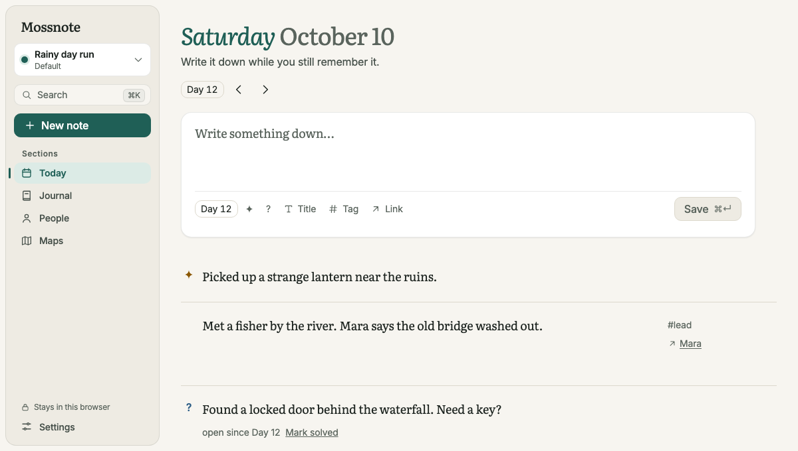
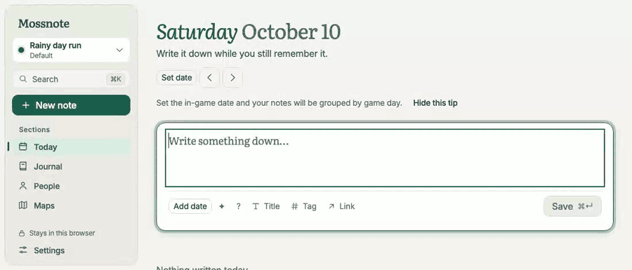
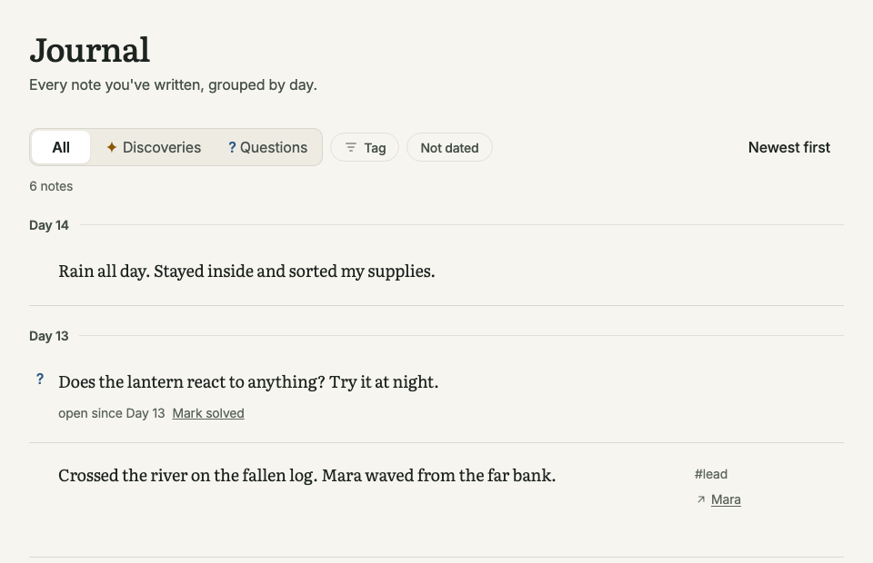
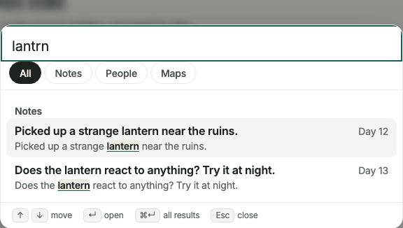
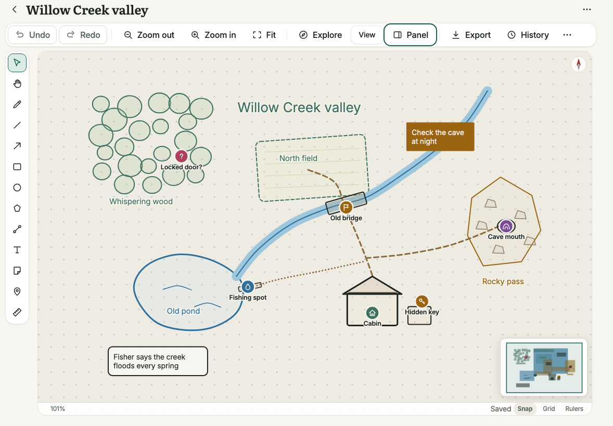
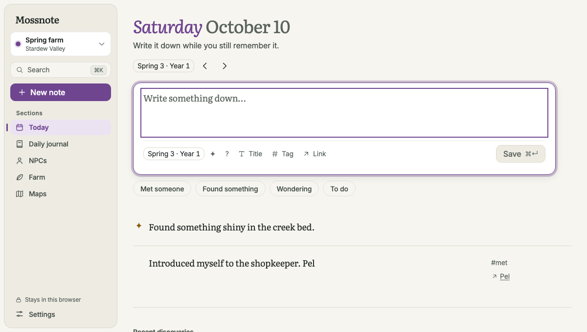
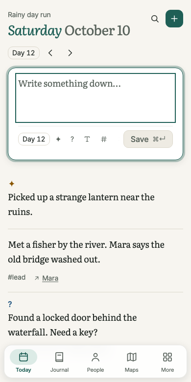

<p align="center">
  
</p>

<p align="center">
  <strong>A private journal for the games you play, with no spoilers.</strong><br>
  Write down what you find out, in your own words. Mossnote keeps your notes in order and never sends them anywhere.
</p>

<p align="center">
  <a href="https://rahulkaushal04.github.io/mossnote/docs/">Documentation</a> ·
  <a href="https://rahulkaushal04.github.io/mossnote/">Web version</a> ·
  <a href="#get-started">Get started</a> ·
  <a href="CONTRIBUTING.md">Contribute</a>
</p>

<p align="center">
  <a href="https://github.com/rahulkaushal04/mossnote/actions/workflows/ci.yml"></a>
  <a href="LICENSE"></a>
  <a href=".nvmrc"></a>
</p>

<p align="center">
  
</p>

> [!NOTE]
> Mossnote has no public release yet. For now, [run it from the source code](#get-started). The `npx` and download options work after the first release. The web version and documentation links work after the project's _Web version_ workflow has been run.

## Why Mossnote

- **No spoilers.** Mossnote knows nothing about any game. There are no names, items or places in it. A new journal is empty, so everything in it is something you wrote.
- **Your notes stay yours.** No account, no tracking, nothing is uploaded. A journal is one file on your computer, or one database in your browser.
- **Made for playing.** Save a note with one key. Your draft is kept if the page closes. You can also write on a phone or tablet next to the game.
- **Easy to look back.** Notes are sorted by in-game day and linked to people, tags and maps. You can find a clue you wrote weeks ago.

## What you can do

### Write fast and link as you type

Today opens with the note box ready. Press <kbd>Cmd</kbd>/<kbd>Ctrl</kbd> + <kbd>Enter</kbd> to save.

- Type `@` to mention a person.
- Type `#` to add a tag.
- Type `[[` to link to another note.
- Mark a note as a discovery ✦ or a question ?.

<p align="center">
  
</p>

<p align="center"><em>Set the day, mention a person, add a tag, mark a question, save.</em></p>

### Find your notes again

The **Journal** shows every note, grouped by in-game day. You can filter by discoveries, open or solved questions, tags and dates.

<p align="center">
  
</p>

**Search** finds words even when you make a typing mistake. Here, `lantrn` finds the word "lantern". You can also use filters such as `is:question`, `#tag` and `@person`.

<p align="center">
  
</p>

A question stays open until you answer it, in your own words. Each person gets a page that lists the notes that mention them.

### Draw the places you explore

Draw boxes, areas, paths and sticky notes. Add named markers that link back to your notes. Rough freehand lines turn into clean shapes. You can save a map as a PNG, SVG or PDF picture, or as a file that you can open again.

<p align="center">
  
</p>

<p align="center"><em>A sample map: <a href="docs/assets/readme/willow-creek.mossmap.json">willow-creek.mossmap.json</a>. To open it, go to <strong>Maps → Open a map file</strong>.</em></p>

### Choose a template

A template changes the words and the layout. It never adds facts about a game. You pick one when you make a journal. Keep one journal for each game.

|          | Default                      | Stardew Valley                                      |
| -------- | ---------------------------- | --------------------------------------------------- |
| Best for | Any single-player game       | Stardew Valley                                      |
| Sections | Today, Journal, People, Maps | Today, Daily journal, NPCs, Farm, Maps              |
| Dates    | Day numbers (Day 12)         | Seasons and years (Spring 3)                        |
| Extras   | None                         | Farm list and four quick buttons under the note box |
| Colour   | Green                        | Purple                                              |

The Default template is in the first picture above. This is the Stardew Valley template:

<p align="center">
  
</p>

### Use it on any screen

On a big screen you get a sidebar. On a tablet you get a slim icon bar. On a phone you get a bar at the bottom. There are light and dark themes, and you can use everything with the keyboard.

<p align="center">
  
</p>

### Keep your notes safe

- Save your journal as a JSON or Markdown file, and load a file back in.
- Mossnote makes backup copies called snapshots, and you can go back to any of them.
- Anything you delete stays in **Recently deleted** for 30 days.

## Get started

Pick the row that matches how you play.

| You play on                                    | Use                                                                                                                        | Your journal is kept        |
| ---------------------------------------------- | -------------------------------------------------------------------------------------------------------------------------- | --------------------------- |
| A PC or laptop, with notes on the same machine | [Run from source](#run-from-source) now. Use [Node](#use-node) or the [program](#use-the-program) after the first release. | In a folder on the computer |
| A PC or laptop, with notes on a phone          | The same, with [phone access](#phone-access) turned on                                                                     | In a folder on the computer |
| A console, with notes on a phone               | The [web version](https://rahulkaushal04.github.io/mossnote/) on the phone                                                 | In the phone's browser      |

A journal on a computer and a journal in a browser are separate. To move one, export it and then import the file on the other side. You will find both in **Settings → Data & backup**.

### Run from source

You need [Node.js](https://nodejs.org) 22.12 or newer.

```bash
git clone https://github.com/rahulkaushal04/mossnote.git
cd mossnote
npm install
npm start
```

`npm start` builds the app if needed, starts it and opens your browser at `http://127.0.0.1:4317`.

### Use Node

After the first release:

```bash
npx mossnote              # try it
npm install -g mossnote   # or install it, then run: mossnote
```

Options: `--port`, `--data-dir`, `--journal`, `--no-open` and `--lan`. Run `mossnote --help` to see what each one does.

### Use the program

After the first release, download the program for your system from the [releases page](https://github.com/rahulkaushal04/mossnote/releases). Check the file against its `.sha256` file.

| System  | File                               | How to run it                                    |
| ------- | ---------------------------------- | ------------------------------------------------ |
| Windows | `mossnote-vX.Y.Z-win-x64.exe`      | Double-click it                                  |
| Linux   | `mossnote-vX.Y.Z-linux-x64.tar.gz` | Unpack it with `tar -xzf`, then run `./mossnote` |

The programs are not code-signed, so Windows may ask you to confirm the first run. On macOS, use Node.

### Your first journal

The first screen asks **Which template?** Pick one, give your journal a name, and start writing. Press `?` in the app to see the keyboard shortcuts. The [getting started guide](https://rahulkaushal04.github.io/mossnote/docs/getting-started/) walks you through the first ten minutes.

### Phone access

You can write on a phone or tablet while the journal stays on your computer.

1. On the computer, open **Settings → Phone**. Turn on **Let phones and tablets on my network open Mossnote**.
2. Choose **Show pairing code**. Scan the QR code with the phone's camera. Both devices must be on the same Wi-Fi.
3. Add the phone to its Home Screen if you like. You can remove the phone later from the same screen.

Only phones that you pair can connect. A code works once and ends after ten minutes. The connection is not encrypted, so use it only on a network you trust, such as your home Wi-Fi. To turn it on when Mossnote starts, use `mossnote --lan`. To keep it off, use `MOSS_LAN=0`.

### Web version

The web version runs in your browser and needs no server. It keeps your journal in the browser and works offline after the first load.

- **Make backups.** The journal exists only in that browser. If you clear the browser's data, it is lost. Download a copy now and then. Mossnote reminds you.
- **Use one tab.** A second tab shows a message instead of risking damage to your notes.
- **Avoid private windows.** They often cannot save files.

To host it yourself, run `npm run build:standalone` and serve the `dist/standalone` folder. For a GitHub project site, set `MOSS_BASE=/repository-name/` first. The repository's _Web version_ workflow does this and also adds the documentation at `/docs/`.

## Your data

Each journal is one SQLite file in a folder that belongs to you.

| System  | Default folder                            |
| ------- | ----------------------------------------- |
| macOS   | `~/Library/Application Support/Mossnote/` |
| Linux   | `~/.local/share/mossnote/`                |
| Windows | `%APPDATA%\Mossnote\`                     |

**Settings → Data & backup** shows the exact folder. To change it, use `--data-dir` or `MOSS_DATA_DIR`. The file is **not encrypted**, so use your system's disk encryption if you need it.

- Updating Mossnote never touches your journals.
- A journal made by a newer version is left alone and shows a message.
- Nothing is shared unless you export a file and send it yourself.

All settings are environment variables. They are listed with comments in [`.env.example`](.env.example). For snapshots and restoring, see the [data and backup guide](https://rahulkaushal04.github.io/mossnote/docs/data-and-backup/).

## Documentation

The guides, tutorials and reference are at [`/docs/`](https://rahulkaushal04.github.io/mossnote/docs/). The source files are in [`docs/`](docs/README.md).

| Page                                                                                | What it covers                           |
| ----------------------------------------------------------------------------------- | ---------------------------------------- |
| [Getting started](https://rahulkaushal04.github.io/mossnote/docs/getting-started/)  | Install, first journal, first note       |
| [Writing notes](https://rahulkaushal04.github.io/mossnote/docs/writing-notes/)      | The note box, tags, people and links     |
| [Maps](https://rahulkaushal04.github.io/mossnote/docs/maps-basics/)                 | Drawing, markers, exploring mode, export |
| [Templates](https://rahulkaushal04.github.io/mossnote/docs/templates/)              | Default and Stardew Valley compared      |
| [Tutorials](https://rahulkaushal04.github.io/mossnote/docs/tutorial-first-session/) | Worked examples, step by step            |
| [Feature list](https://rahulkaushal04.github.io/mossnote/docs/feature-inventory/)   | Every feature and how well it works      |
| [Troubleshooting](https://rahulkaushal04.github.io/mossnote/docs/troubleshooting/)  | Messages and how to fix them             |

## Development

You need Node 22.12 or newer. The `.nvmrc` file has the version that the project uses.

```bash
npm install
npx playwright install chromium   # once, for the browser tests
npm run dev                       # API on 4317, Vite on 5173, data in ./.dev-data
npm run check                     # lint, type check and unit tests
npm run test:e2e                  # build, then run the browser tests
npm run docs:build                # build the documentation
```

The code has four folders. A lint rule controls which folder may use which.

```text
src/shared      Shared rules, dates and limits. No Node or browser code
src/server      The API, the SQLite database, migrations and snapshots
src/standalone  The server code, running inside a browser worker (web version)
src/web         The React app
```

The same code runs in Node and in the browser. Only the code that touches files is different. It sits behind two small interfaces, `Sqlite` and `Storage`. The other scripts are described in [CONTRIBUTING](CONTRIBUTING.md) and on the [how it works](https://rahulkaushal04.github.io/mossnote/docs/how-it-works/) page.

When someone pushes a tag such as `v0.2.0`, [`release.yml`](.github/workflows/release.yml) checks the code, builds and tests the Windows and Linux programs, and adds them to a draft release.

## What Mossnote will not do

These are left out on purpose: image attachments, imported map images, tag colours, checklists, completion tracking, cloud sync, accounts, rich text, statistics, AI features and plugins. They are decisions, not a to-do list, so requests for them will be closed.

## Help and contributing

- **Need help?** See [SUPPORT](.github/SUPPORT.md).
- **Found a security problem?** Report it in private. Read [SECURITY](SECURITY.md).
- **Want to contribute?** Read [CONTRIBUTING](CONTRIBUTING.md) first. Open an issue before a big change, and never add facts about a game.
- Everyone follows the [Code of Conduct](CODE_OF_CONDUCT.md). Changes are listed in the [changelog](CHANGELOG.md).

## Licence

MIT. See [LICENSE](LICENSE).

The fonts are [Literata](https://github.com/googlefonts/literata) and [Inter](https://github.com/rsms/inter), included through the `@fontsource-variable` packages under the SIL Open Font License 1.1. The web version also includes [SQLite WebAssembly](https://github.com/sqlite/sqlite-wasm) (Apache-2.0).
